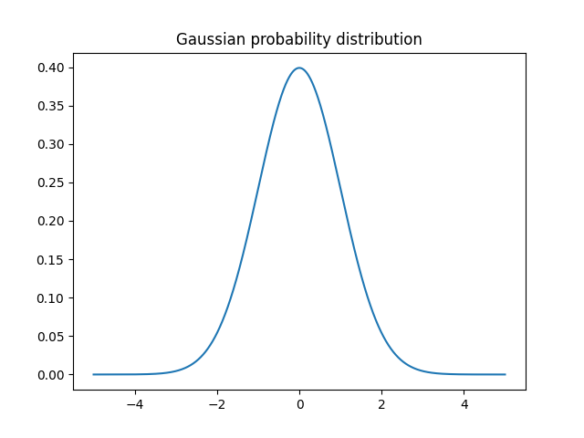
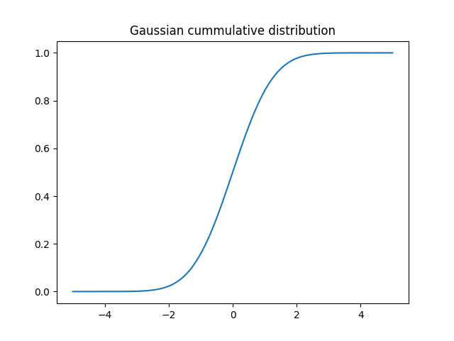
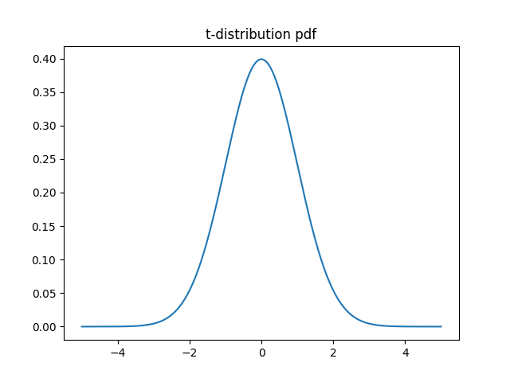
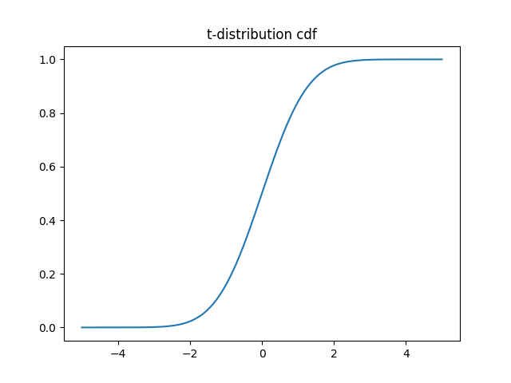

## Statistical Distribution
* A sample of data will form a distribution, and by far the most well known is the __Gaussian distribution__, often called the Normal distribution.
* The distribution provides a parameterized mathematical function that can be used to calculate the probability for any individual observation from the sample space.
* This distribution describes the grouping or the density of the observations, called the probability density function.
* We can also calculate the likelihood of an observation having a value equal to or lesser than a given value.
* A summary of these relationships between observations is called a cummulative density function.

 

### 1. Distributions
* From a practical perspective, we can think of a distribution as a function that describes the relationship between observations in a sample space.
* For example, we may be interested in the age of humans, with individual ages representing observations in the domain, and ages 0 to 125 the extent of the sample space.
* The distribution is a mathematical function that describes the relationship of observations of different heights.

 

* Many data conform to well-known and well-understood mathmatical functions, such as the Guassian distribution. A function can fit the data with a modification of the parameters of the function, such as the mean and standard deviation in the case of the Gaussian.
* Once a distribution function is known, it can be used as a shorthand for describing and calculating related quantities, such as likelihoods of observations, and plotting the relationship between observation in the domain.

 

### 1.1. Density Functions
* Distributions are often descirbed in terms of their density or density functions.
* Density functions are functions that describe how the proportion of data or likelihood of the proportion of observations change over the range of the distribution.
* Two types of density functions are probability density functions and cummulative density functions.

    * __Probability Density function__: calculates the probability of observing a given value.
    * __Cummulative Density function__: calculates the probability of an observation equal or less than a value.

 

* A probability density function, or PDF, can be used to calculate the likelihood of a given observation in a distribution. It can also be used to summarize the likelihood of observations across the distribution's sample space.
* Plots of the PDF show the familiar shape of a distribution, such as the bell-curve for the Gaussian distribution.
* Distribution are often defined in terms of their probability density functions with their associated parameters.

 

* A cummulative density function, or CDF, is a different way of thinking about the likelihood of observed values. Rather than calculating the likelihood of a given observation as with the PDF, the CDF calculates the cummulative likelihood for the observation and all prior observations in the sample spaces.
* It allows you to quickly understand and comment on how much of the distribution lies before and ofter a given value.
* A CDF is often plotted as a curve from 0 to 1 for the distribution.

 

* Both PDFs and CDFs are continuous functions. The equivalent of a PDF for a discrete distribution is called a probability mass function, or PMF.
* Next, let's look at the Gaussian distribution and two other distributions related to the Gaussian that you will encounter when using statistical methods.

 

### 2. Gaussian Distribution
* The Gaussian distribution is the focus of much of the field of statistics. Data from many fields of study surprisingly can be described using a Gaussian distribution, so much so that the distribution is often called the _normal_ distribution because it is so common.
* A Gaussian distribution can be described using two parameters.
    
    * mean: Denoted with the Greek lowercase letter mu ($\mu$), is the expected value of the distribution.
    * variance: Denoted with the Greek lowercase letter sigma $(\sigma^2)$ raised to the second power (because the units of the variable are squared), describes the spread of observation from the mean.

* It is common to use a normalized calculation of the variance called the standard deviation.

    * standard deviation: Denoted with the Greek lowercase letter sigma $(\sigma)$, describes the normalized spread of observations from the mean.

* We can work with the Gaussian distribution via the `norm SciPy` module. The `norm.pdf()` function can be used to create a Gaussian probability density funciton with a given sample space, mean, and standard deviation.

 

[Gaussian probability distribution example](./gaussian_pdf.py)

 

* Running the example creates a line plot showing the sample space in the x-axis and the likelihood of each value of the y-axis.
* The line plot shows the familiar bell-shape for the Gaussian distribution.
* The top of the bell shows the most likely value from the distribution, called the expected value or the mean, which in this case is zero, as we specified in creating the distribution.

 

 

The `norm.cdf()` function can be used to create a Gaussian cummulative density function.

 

[Gaussian cummulative distribution example](./gaussian_cdf.py)

 

* Running the example creates a plot showing an S-shape with the sample space on the x-axis and the cummulative probability of the y-axis.
* We can see that a value of 2 covers close to 100% of the observations, with only a very thin tail of the distribution beyond that point.
* We can also see that the mean value of zero shows 50% of the observations before and after that point.

 

 

### 3. Student's t-Distribution
* The Student's t-distribution, or just t-distribution for short, is named for the pseudonym _Student_ by William Sealy Gosset.
* It is a distribution that arises when attempting to estimate the mean of a normal distribution with different sized samples.
* As such, it is a helpful shortcut when describing uncertainty or error related to estimating population statistics for data drawn from Gaussian distributions when the size of the sample must be taken into account.
* Although you may not use the Student's t-distribution directly, you may estimate values from the distribution required as parameters in other statistical methods, such as statistical significance tests.
* The distribution can be described using a single parameter:

    * number of degrees of freedom: denoted with the lowercase Greek letter nu $(\nu)$, denotes the number degrees of freedom.

 

* Key to the use of the t-distribution is knowing the desired number of degrees of freedom. The number of degrees of freedom describes the number of pieces of information used to describe a population quantity.
* For example, the mean has $n$ degrees of freedom as all $n$ observations in the sample are used to calculate the estimate of the population mean.
* A statistical quantity that makes use of another statistical quantity in its calculation must substract 1 from the degrees of freedom, such as the use of the mean in the calculation of the sample variance.
* Observations in a Student's t-distribution are calculated from observations in a normal distribution in order to describe the interval for the polulations mean in the normal distribution.
* Observations are calculated as:

<br?>

* $ data = x - \frac{mean(x)}{\frac{S}{\sqrt n}}  $

 

* Where $x$ is the observations from the Gaussian distribution, _mean_ is the average observation of $x$, $S$ is the standard deviation and $n$ is the total number of observations.
* The resulting observations form the t-observation with $(n-1)$ degrees of freedom.
* In practice, if you require a value from a t-distribution in the calculation of a statistic, then the number of degrees of freedom will likely be $n-1$, where $n$ is the size of your sample drawn from a Gaussian distribution.

 

* `SciPy` provides tools for working with the t-distribution in the `stats.t` module.
* The `t.pdf()` function can be used to create a Student's t-distribution with the specified degrees of freedom.

 

[t-disribution pdf example](./t_distribution_pdf.py)

 

* Running the example creates and plots the t-distribution PDF.
* We can see the familiar bell-shape to the distribution much like the normal.
* A key difference is the fatter tails in the distribution, highlighting the increased likelihood of observations in the tails compared to that of the Gaussian

 

 

* The `t.cdf()` function can be used to create the cummulative density function for the t-distribution.

 

[t-disribution cdf example](./t_distribution_cdf.py)

 

* Running the example, we see the familiar S-shaped curve as we see with the Gaussian distribution, although with slightly softer transitions from zero-probability to one-probability for the fatter tails.

 

 

 

### Reference: Probability for Machine Learning - Discover How To Harness Uncertainty With Python